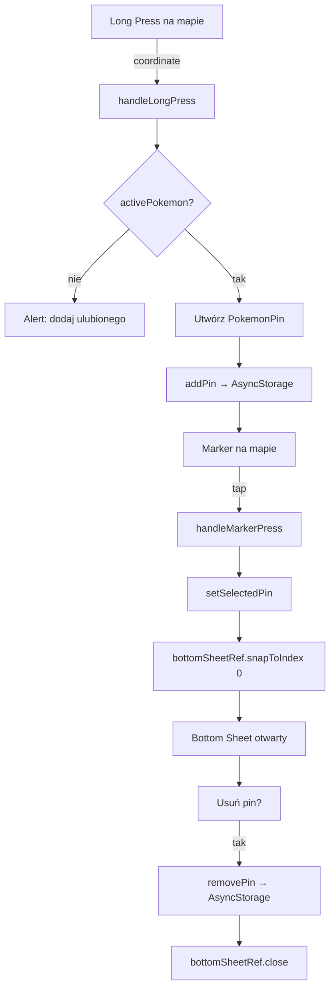

# Plan Implementacji: Map Screen

## Wymagania
- Wyświetlaj mapę
- **Long press** na mapie → dodaj nowy pin
- **Tap na pin** → otwórz bottom sheet / modal z informacją o pokémonie
- Pin musi mieć powiązanego Pokémona (aktywny ulubiony z `FavouritesContext`)
- Dane persistowane (piny zostają po restart)

---

## Stos technologiczny (zweryfikowany)

| Biblioteka | Cel | Uwagi |
|---|---|---|
| `react-native-maps` | Mapa (Apple Maps iOS / Google Maps Android) | Stabilna, obsługiwana przez Expo |
| `@gorhom/bottom-sheet` | Bottom sheet po tapie w pin | Wymaga Reanimated + GestureHandler |
| `react-native-reanimated` | Wymagany przez bottom-sheet | Prawdopodobnie już jest |
| `react-native-gesture-handler` | Wymagany przez bottom-sheet | Prawdopodobnie już jest |

> [!NOTE]
> `react-native-maps` na iOS używa **Apple Maps domyślnie** — nie potrzebuje klucza API. Na Androidzie potrzebuje Google Maps API Key (dodajemy do `app.json`).

---

## KROK 1 — Instalacja

```bash
npx expo install react-native-maps
npx expo install @gorhom/bottom-sheet
npx expo install react-native-reanimated
npx expo install react-native-gesture-handler
```

Sprawdź czy `react-native-reanimated` i `react-native-gesture-handler` już są — jeśli tak, `expo install` tylko potwierdzi wersje.

---

## KROK 2 — babel.config.js (NOWY PLIK — jeśli nie istnieje)

```js
// babel.config.js
module.exports = function (api) {
  api.cache(true);
  return {
    presets: ['babel-preset-expo'],
    plugins: [
      'react-native-reanimated/plugin', // MUSI być ostatni
    ],
  };
};
```

> [!WARNING]
> Jeśli `babel.config.js` już istnieje — tylko sprawdź czy `reanimated/plugin` jest na liście. Po każdej zmianie uruchom `npx expo start --clear`.

---

## KROK 3 — app.json — dodaj plugin react-native-maps

```json
{
  "expo": {
    "plugins": [
      "expo-router",
      "expo-status-bar",
      [
        "react-native-maps",
        {
          "googleMapsApiKey": "TWÓJ_KLUCZ_ANDROID"
        }
      ]
    ],
    "android": {
      "config": {
        "googleMaps": {
          "apiKey": "TWÓJ_KLUCZ_ANDROID"
        }
      }
    }
  }
}
```

> [!NOTE]
> Klucz Google Maps jest wymagany **tylko dla Androida**. Na iOS Apple Maps działa bez klucza. Klucz możesz ustawić tymczasowo jako `""` i aplikacja uruchomi się na iOS bez problemu.

---

## KROK 4 — GestureHandlerRootView w _layout.tsx

`@gorhom/bottom-sheet` wymaga `GestureHandlerRootView` jako korzenia drzewa komponentów.

### [MODIFY] `app/_layout.tsx`

```tsx
import { GestureHandlerRootView } from 'react-native-gesture-handler';
import { StyleSheet } from 'react-native';
// ... pozostałe importy

export default function RootLayout() {
  return (
    <GestureHandlerRootView style={StyleSheet.absoluteFill}>
      <FavouritesProvider>
        <Stack>
          {/* ... tabs */}
        </Stack>
      </FavouritesProvider>
    </GestureHandlerRootView>
  );
}
```

---

## Model danych

```ts
// src/features/map/types/PokemonPin.ts
export interface PokemonPin {
  id: string;               // uuid / timestamp jako string
  coordinate: {
    latitude: number;
    longitude: number;
  };
  pokemon: {
    name: string;
    url: string;            // URL do API pokémona (żeby pobrać obrazek)
  };
  createdAt: number;        // timestamp
}
```

---

## Nowe pliki

### `src/features/map/storage/mapPinsStorage.ts`

```ts
import AsyncStorage from '@react-native-async-storage/async-storage';
import { PokemonPin } from '../types/PokemonPin';

const KEY = 'pokemon_map_pins';

export async function getPins(): Promise<PokemonPin[]> {
  const raw = await AsyncStorage.getItem(KEY);
  return raw ? JSON.parse(raw) : [];
}

export async function savePins(pins: PokemonPin[]): Promise<void> {
  await AsyncStorage.setItem(KEY, JSON.stringify(pins));
}
```

### `src/features/map/hooks/useMapPins.ts`

```ts
import { useState, useEffect, useCallback } from 'react';
import { getPins, savePins } from '../storage/mapPinsStorage';
import { PokemonPin } from '../types/PokemonPin';

export function useMapPins() {
  const [pins, setPins] = useState<PokemonPin[]>([]);
  const [isLoaded, setIsLoaded] = useState(false);

  useEffect(() => {
    getPins().then((data) => {
      setPins(data);
      setIsLoaded(true);
    });
  }, []);

  const addPin = useCallback((pin: PokemonPin) => {
    setPins((prev) => {
      const next = [...prev, pin];
      savePins(next);
      return next;
    });
  }, []);

  const removePin = useCallback((id: string) => {
    setPins((prev) => {
      const next = prev.filter((p) => p.id !== id);
      savePins(next);
      return next;
    });
  }, []);

  return { pins, isLoaded, addPin, removePin };
}
```

---

## Główny plik: `app/(tabs)/map.tsx`

### Szkic UI

```
┌─────────────────────────────────┐
│  🗺️ Mapa Pokémonów              │
├─────────────────────────────────┤
│                                 │
│    [Apple Maps / Google Maps]   │
│                                 │
│    📍 pin #1 (Pikachu)         │
│    📍 pin #2 (Charmander)      │
│                                 │
│  Long press → nowy pin          │
│                                 │
└─────────────────────────────────┘
         ↓ tap na pin ↓
┌─────────────────────────────────┐
│  ━━━━━━━━━  (handle)            │
│                                 │
│  [Obrazek Pokémona]             │
│  Pikachu                        │
│  ⭐ Ulubiony Pokémon             │
│  📍 Dodano: 3 lip 2026          │
│                                 │
│  [🗑️ Usuń pin]                  │
│                                 │
└─────────────────────────────────┘
```

### Pełny kod `app/(tabs)/map.tsx`

```tsx
import React, { useRef, useCallback, useState } from 'react';
import {
  View, Text, StyleSheet, Image, Pressable, Alert,
} from 'react-native';
import MapView, { Marker, LongPressEvent, MapPressEvent } from 'react-native-maps';
import BottomSheet, { BottomSheetView } from '@gorhom/bottom-sheet';
import { useFavouritesContext } from '../../src/features/favourites/context/FavouritesContext';
import { useMapPins } from '../../src/features/map/hooks/useMapPins';
import { PokemonPin } from '../../src/features/map/types/PokemonPin';
import { getPokemonImageUrl } from '../../src/shared/utils/getPokemonImageUrl';
import { formatPokemonName } from '../../src/shared/utils/formatPokemonName';

// Snap points: 0% (zamknięty), 45% ekranu
const SNAP_POINTS = ['45%'];

export default function MapScreen() {
  const { favourites } = useFavouritesContext();
  const { pins, addPin, removePin } = useMapPins();
  const bottomSheetRef = useRef<BottomSheet>(null);
  const [selectedPin, setSelectedPin] = useState<PokemonPin | null>(null);

  // Aktywny pokémon = pierwszy z listy ulubionych
  const activePokemon = favourites[0] ?? null;

  // Long press na mapie → dodaj pin z aktywnym pokémonem
  const handleLongPress = useCallback(
    (event: LongPressEvent) => {
      if (!activePokemon) {
        Alert.alert(
          '🤍 Brak ulubionego Pokémona',
          'Dodaj ulubionego Pokémona na liście, żeby umieścić go na mapie!'
        );
        return;
      }

      const newPin: PokemonPin = {
        id: Date.now().toString(),
        coordinate: event.nativeEvent.coordinate,
        pokemon: {
          name: activePokemon.name,
          url: activePokemon.url,
        },
        createdAt: Date.now(),
      };

      addPin(newPin);
    },
    [activePokemon, addPin]
  );

  // Tap na marker → otwórz bottom sheet
  const handleMarkerPress = useCallback((pin: PokemonPin) => {
    setSelectedPin(pin);
    bottomSheetRef.current?.snapToIndex(0);
  }, []);

  // Usuń pin z bottom sheeta
  const handleRemovePin = useCallback(() => {
    if (!selectedPin) return;
    removePin(selectedPin.id);
    bottomSheetRef.current?.close();
    setSelectedPin(null);
  }, [selectedPin, removePin]);

  // Zamknięcie bottom sheeta
  const handleSheetClose = useCallback(() => {
    setSelectedPin(null);
  }, []);

  return (
    <View style={styles.container}>
      {/* Mapa */}
      <MapView
        style={styles.map}
        initialRegion={{
          latitude: 52.2297,     // Warszawa jako domyślna lokalizacja
          longitude: 21.0122,
          latitudeDelta: 0.05,
          longitudeDelta: 0.05,
        }}
        onLongPress={handleLongPress}
        showsUserLocation={true}
        showsMyLocationButton={true}
      >
        {pins.map((pin) => (
          <Marker
            key={pin.id}
            coordinate={pin.coordinate}
            onPress={() => handleMarkerPress(pin)}
          >
            {/* Custom marker: obrazek pokémona */}
            <View style={styles.markerContainer}>
              <Image
                source={{ uri: getPokemonImageUrl(pin.pokemon.url) }}
                style={styles.markerImage}
              />
            </View>
          </Marker>
        ))}
      </MapView>

      {/* Wskazówka dla użytkownika */}
      <View style={styles.hint}>
        <Text style={styles.hintText}>
          {activePokemon
            ? `Przytrzymaj mapę, aby dodać ${formatPokemonName(activePokemon.name)}`
            : '🤍 Dodaj ulubionego Pokémona'}
        </Text>
      </View>

      {/* Bottom Sheet — informacje o pinie */}
      <BottomSheet
        ref={bottomSheetRef}
        index={-1}                    // Zamknięty domyślnie
        snapPoints={SNAP_POINTS}
        enablePanDownToClose={true}
        onClose={handleSheetClose}
        backgroundStyle={styles.sheetBackground}
        handleIndicatorStyle={styles.sheetHandle}
      >
        <BottomSheetView style={styles.sheetContent}>
          {selectedPin && (
            <PinBottomSheetContent
              pin={selectedPin}
              onRemove={handleRemovePin}
            />
          )}
        </BottomSheetView>
      </BottomSheet>
    </View>
  );
}

// Oddzielny komponent dla zawartości bottom sheeta
function PinBottomSheetContent({
  pin,
  onRemove,
}: {
  pin: PokemonPin;
  onRemove: () => void;
}) {
  const imageUrl = getPokemonImageUrl(pin.pokemon.url);
  const formattedDate = new Date(pin.createdAt).toLocaleDateString('pl-PL', {
    day: 'numeric',
    month: 'long',
    year: 'numeric',
  });

  return (
    <View style={styles.sheetInner}>
      {/* Obrazek pokémona */}
      <Image
        source={{ uri: imageUrl }}
        style={styles.sheetPokemonImage}
        resizeMode="contain"
      />

      {/* Nazwa */}
      <Text style={styles.sheetPokemonName}>
        {formatPokemonName(pin.pokemon.name)}
      </Text>

      {/* Data dodania */}
      <Text style={styles.sheetDate}>📍 Dodano: {formattedDate}</Text>

      {/* Koordynaty */}
      <Text style={styles.sheetCoords}>
        {pin.coordinate.latitude.toFixed(4)}°N,{' '}
        {pin.coordinate.longitude.toFixed(4)}°E
      </Text>

      {/* Przycisk usuń */}
      <Pressable
        style={({ pressed }) => [styles.removeBtn, pressed && styles.removeBtnPressed]}
        onPress={onRemove}
      >
        <Text style={styles.removeBtnText}>🗑️ Usuń pin</Text>
      </Pressable>
    </View>
  );
}

const styles = StyleSheet.create({
  container: { flex: 1 },

  map: { flex: 1 },

  markerContainer: {
    width: 44,
    height: 44,
    borderRadius: 22,
    backgroundColor: '#fff',
    borderWidth: 2,
    borderColor: '#3b4cca',
    overflow: 'hidden',
    alignItems: 'center',
    justifyContent: 'center',
    // Cień
    shadowColor: '#000',
    shadowOffset: { width: 0, height: 2 },
    shadowOpacity: 0.25,
    shadowRadius: 4,
    elevation: 4,
  },
  markerImage: { width: 36, height: 36 },

  hint: {
    position: 'absolute',
    bottom: 24,
    left: 16,
    right: 16,
    backgroundColor: 'rgba(255,255,255,0.92)',
    borderRadius: 16,
    paddingVertical: 10,
    paddingHorizontal: 16,
    alignItems: 'center',
    shadowColor: '#000',
    shadowOffset: { width: 0, height: 2 },
    shadowOpacity: 0.1,
    shadowRadius: 8,
    elevation: 4,
  },
  hintText: { fontSize: 14, color: '#374151', fontWeight: '500' },

  // Bottom sheet styles
  sheetBackground: { backgroundColor: '#fff', borderRadius: 24 },
  sheetHandle: { backgroundColor: '#D1D5DB', width: 40 },

  sheetContent: { flex: 1 },
  sheetInner: {
    flex: 1,
    alignItems: 'center',
    paddingHorizontal: 24,
    paddingTop: 8,
    paddingBottom: 32,
  },
  sheetPokemonImage: {
    width: 120,
    height: 120,
    marginBottom: 12,
  },
  sheetPokemonName: {
    fontSize: 26,
    fontWeight: '800',
    color: '#1F2937',
    marginBottom: 4,
  },
  sheetDate: {
    fontSize: 14,
    color: '#6B7280',
    marginBottom: 2,
  },
  sheetCoords: {
    fontSize: 12,
    color: '#9CA3AF',
    marginBottom: 24,
    fontFamily: 'monospace',
  },
  removeBtn: {
    backgroundColor: '#FEE2E2',
    borderRadius: 12,
    paddingVertical: 12,
    paddingHorizontal: 28,
    marginTop: 'auto',
  },
  removeBtnPressed: { opacity: 0.75 },
  removeBtnText: { color: '#DC2626', fontWeight: '700', fontSize: 16 },
});
```

---

## Struktura nowych plików

```
src/features/map/
├── hooks/
│   └── useMapPins.ts           ← zarządzanie pinami
├── storage/
│   └── mapPinsStorage.ts       ← AsyncStorage CRUD
└── types/
    └── PokemonPin.ts           ← interfejs danych

app/(tabs)/map.tsx              ← NOWY (reimplementacja)
app/_layout.tsx                 ← MODIFY (GestureHandlerRootView)
babel.config.js                 ← NOWY (jeśli nie istnieje)
app.json                        ← MODIFY (plugin react-native-maps)
```

---

## Przepływ danych



---

## Kolejność implementacji

```
[1]  npx expo install react-native-maps @gorhom/bottom-sheet react-native-reanimated react-native-gesture-handler
[2]  Utwórz/zaktualizuj babel.config.js
[3]  Dodaj plugin do app.json
[4]  Dodaj GestureHandlerRootView do app/_layout.tsx
[5]  Utwórz src/features/map/types/PokemonPin.ts
[6]  Utwórz src/features/map/storage/mapPinsStorage.ts
[7]  Utwórz src/features/map/hooks/useMapPins.ts
[8]  Zaimplementuj app/(tabs)/map.tsx
[9]  npx expo start --clear (restart z czystym cache)
[10] Test: Long press → pin pojawia się na mapie
[11] Test: Tap na pin → bottom sheet z pokémonem
[12] Test: Usuń pin → znika z mapy i AsyncStorage
```

---

## Uwagi i gotchas

| Problem | Rozwiązanie |
|---|---|
| Mapa biała na iOS Simulator | Normalny błąd symulatora — testuj na urządzeniu lub sprawdź opcję "Show Map" w Simulator |
| Bottom sheet nie otwiera się | Sprawdź czy `GestureHandlerRootView` jest w `_layout.tsx` |
| Pin nie znika po usuń | Sprawdź czy `removePin` poprawnie filtruje po `id` |
| `snapToIndex(-1)` vs `close()` | Użyj `bottomSheetRef.current?.close()` do zamknięcia |
| Android: biała mapa | Potrzebujesz Google Maps API Key |
| Reanimated warning | `npx expo start --clear` po zmianie babel.config.js |
